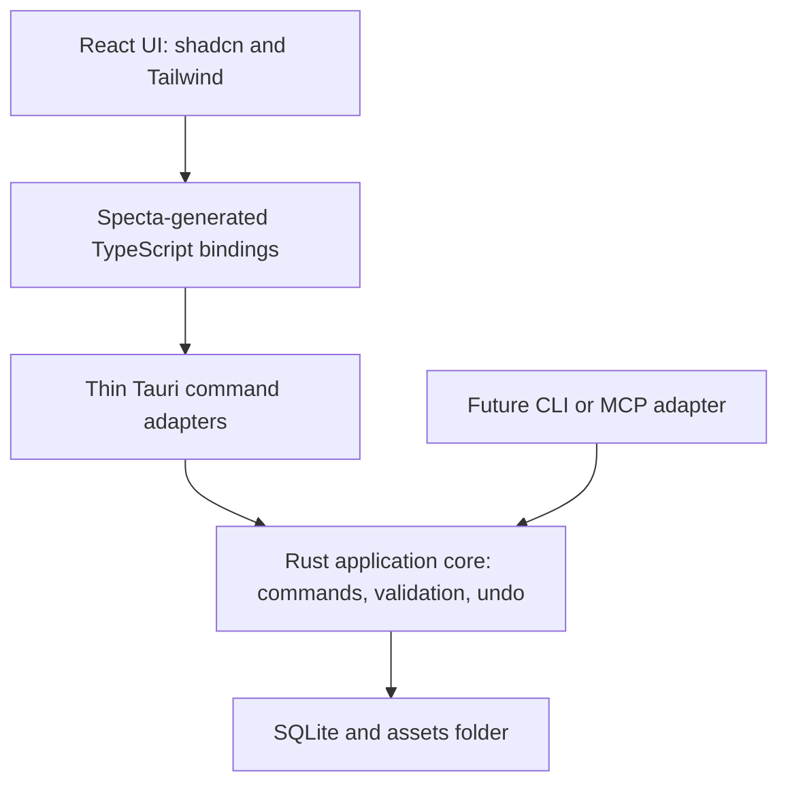

# Backend Architecture

Working outline for the technical design. See [Brainstorm](brainstorm-doc.md) for feature ideas, [UI/UX](ui-ux.md) for interface decisions, [Campaign Data Model](data-model.md) for candidate objects and attributes, and [Maps and Exploration](maps.md) for the linked-map workflow.

## Known requirements

- The app is a Tauri desktop application with separate GM and player windows. The player window exists only during an active presentation; closing it ends that presentation.
- Campaign data needs local saves, multiple campaigns or save versions, and backups. V1 keeps each campaign's SQLite database and imported images together in a portable campaign folder.
- Changes should support undo and redo.
- V1 has one statblock input field set, D&D 5.5e, for NPCs and enemies. It stores entered values without automated mechanics. Other field sets and custom fields are later features; changing the setting later must preserve existing values.
- A future MCP interface or CLI should let an AI assistant inspect and change campaign data.

## Application modules (proposal for discussion)

These are logical responsibility boundaries within one application; they do not each require a separate package or sidebar entry. The feature inventory includes puzzles, rewards, crafting, and animation as well as campaign authoring and presentation.

| Module | Responsibility |
| --- | --- |
| Campaign and reference records | Campaign settings; NPCs, enemies, factions, locations, story threads, relationships, public knowledge, and statblock values |
| Bestiary and import | Protected imported creature definitions, source/version tracking, validation, and creating editable NPC copies; see the [data model](data-model.md#bestiary-creature-instances-and-npcs) |
| Sessions and notes | Plans, recaps, story beats, record links, and recorded location visits |
| Maps and exploration | Linked maps, pins, tokens, party position, fog, grids, and distance measurement |
| Encounters | Encounter participants, initiative, and encounter progress; exact scope still to discuss |
| Items and inventory | Item definitions, quantities, and party inventory |
| Loot and unboxing | Chests containing multiple items, reveal progress, and any explicit award to inventory |
| Crafting | Material contributions, recycling, projects, progress, and completion |
| Puzzles | Reusable puzzle definitions, GM-only solutions, current puzzle progress, and player-safe display data; puzzle types still to discuss |
| Media and story cues | Images, chest-opening video playback, and song links; provider playback integration still to discuss |
| Presentation | Live/Next, player-safe composition, NPC presence, overlays, selected view, pause/resume, and elapsed timer |
| Workspace and navigation | GM/Presenter modes, tabs, splits, inspectors, scroll positions, search, and command palette |
| Commands and history | Shared mutation execution, validation, transaction coordination, undo, and redo |
| Storage and assets | SQLite, migrations, imported files, thumbnails, backups, and asset lifecycle |

Proposed state ownership: Rust owns saved domain state and authoritative presentation state; React owns editor drafts, workspace interaction, and visual rendering. Persist workspace restoration details through Rust. Ownership and draft recovery remain discussion points.

Chest opening plays a video. Loot owns the chest's contents and reveal progress, media handles the video, and presentation controls when it appears. Inventory changes are domain operations; replaying the video must not award items again. Imported videos use the campaign asset lifecycle alongside images. Video playback position and its behavior on Pause/Resume and recovery remain to be specified.

Simple UI motion, including token movement tweening and fades, belongs in the React components with shared motion helpers where useful. It does not need a separate application module or a custom SVG animation system. Save the resulting token position or other meaningful state; intermediate tween frames are rendering details. Motion on the player screen must respect presentation Pause.

## Implementation tooling

Keep the existing **React + TypeScript + Vite / Tauri 2 + Rust** foundation. Use shadcn/ui, Tailwind CSS v4, and incremental `@shadcn/lint` rules as described in [UI/UX](ui-ux.md#ui-tooling-decision). Campaign storage remains SQLite plus an assets folder.

### Rust-to-TypeScript bindings

Select **Specta + `tauri-specta`** for generated frontend types, Tauri command wrappers, and typed events, subject to a small integration validation before expanding the command catalog. Define request, response, and structured error types in Rust, then generate the TypeScript bindings used by the frontend. Regenerate bindings after contract changes and add a CI check that detects stale generated output alongside frontend type-checking.

Keep business rules and persistence in the application core so the future CLI/MCP interface can reuse them without a window or Tauri IPC. Specta handles type generation at the frontend boundary; runtime validation, domain command execution, undo, and database migrations remain application responsibilities. Define dedicated player-safe output types and events, separate from full GM records, and enforce their contents before publishing to the player window.

**Version caveat, researched September 25, 2026:** the upstream compatibility table pairs Tauri 2 with Specta 2 and Tauri Specta 2. Its v2 documentation link currently resolves to `2.0.0-rc.25`, while default stable documentation still describes v1. Pin a tested compatible version combination and use its version-specific examples; do not assume an unqualified stable install targets Tauri 2. See the [Tauri Specta repository and compatibility table](https://github.com/specta-rs/tauri-specta) and [v2 release documentation](https://docs.rs/crate/tauri-specta/2.0.0-rc.25).

### Initial implementation sequence

1. Establish light/dark tokens and a small set of shadcn components.
2. Build an NPC form that calls a Rust domain command through generated bindings.
3. Save the NPC in SQLite and return a typed result or structured error.
4. Display its explicitly player-safe version in the separate player window.
5. Add initial design-system lint rules and a generated-binding freshness check.

Use this small end-to-end feature to validate the chosen dependency versions and the UI, command, storage, and presentation boundaries before expanding into the full workspace and map system. These decisions document the intended stack; the dependencies and checks still need to be implemented.

## Command model (proposal for discussion)

A domain command is a named request to change campaign or live presentation state. The same command handler should validate and execute requests from the GM interface, a future CLI, and a future MCP interface. Reads such as search, list, and get are **queries**; they do not enter undo history.

This is separate from Tauri's `#[tauri::command]` mechanism, which carries calls from the React interface to Rust. A thin Tauri endpoint can pass a typed request to the domain command handler. A CLI can call that handler directly, without depending on a window or Tauri IPC. Do not make a separate Tauri endpoint or CLI implementation of each business rule.

Workspace navigation has its own state and actions. For example, closing a tab in either mode or a GM workspace window and reopening it with `Cmd+Shift+T` should restore the view and layout without entering campaign-edit undo history. The player window is excluded: closing it stops active output, and Play restores its saved presentation checkpoint.

Keep **GM mode** and **Presenter mode** as separate workspace state under one app shell, sidebar, and tab bar. Each stores its open tabs, selected tab, sidebar width and visibility, per-tab scroll positions, and relevant local view state such as map pan/zoom, filters, and selected records. GM mode also stores split pane arrangement and sizes; Presenter has one preview. Switching modes swaps the sidebar and tab bar contents and restores the corresponding workspace without replaying presentation commands or changing Live output. Persist this workspace state per campaign across app restarts, independently of campaign records and the active presentation session. Restore scroll or map position after the target view is ready, using stable record/view IDs; missing records should fall back gracefully.

Each command should identify its campaign, command type, and validated payload. Execution either returns a result or a structured error. A successful campaign edit saves its state change and its undo information as one operation; a failed command changes neither. Multi-step changes, such as promoting an enemy to an NPC, should be one undoable operation.

### Initial command catalog

Candidate identifiers are shown below to make the boundary concrete. These are a design proposal, not a final API or CLI syntax.

| Area | Candidate commands |
| --- | --- |
| Campaign | `CreateCampaign`, `RenameCampaign` |
| Sessions | `CreateSession`, `UpdateSessionPlan`, `UpdateSessionRecap`, `CreateStoryBeat`, `UpdateStoryBeat`, `ReorderStoryBeats`, `RemoveStoryBeat`, `LinkStoryBeatToPin`, `RecordLocationVisit`, `UpdateLocationVisit`, `RemoveLocationVisit` |
| Campaign records | `CreateNpc`, `UpdateNpc`, `RemoveNpc`; the same create/update/remove pattern for `Item`, `Location`, `Map`, `Faction`, `Thread`, and `Puzzle` |
| Bestiary | `ImportBestiary`, `CreateNpcFromBestiary`, `PromoteEncounterParticipantToNpc`; imported source entries are protected from ordinary record editing |
| Relationships | `LinkRecords`, `UnlinkRecords` (with validated relationship types, such as NPC–faction, location–map, or story beat–NPC) |
| Player knowledge | `RevealRecordToPlayers`, `HideRecordFromPlayers`, `UpdatePlayerFacingDetails` |
| Media | `ImportImage`, `AttachImage`, `DetachImage`, `AttachSongLink`, `UpdateSongLink`, `RemoveSongLink` |
| Maps and encounters | `AddMapPin`, `MoveMapPin`, `UpdateMapPin`, `RemoveMapPin`, `LinkPinToMap`, `SetPinVisibility`, `MovePartyMarker`, `PaintFog`, `PlaceToken`, `MoveToken`, `RemoveToken`, `SetInitiative` |
| Specialized changes | `RecycleItem`, `StartCraftingProject`, `ContributeCraftingMaterial`, `UpdateCraftingProgress`, `CompleteCraftingProject` |
| Statblocks | `CreateStatblock`, `UpdateStatblock`, `RemoveStatblock` using the bundled D&D 5.5e field set |
| Presentation | `PlayPresentation`, `StopPresentation`, `PausePresentation`, `ResumePresentation`, `StartNewPresentation`, `ActivatePresenterTab`, `StagePlayerView`, `StageBaseVisual`, `StageOverlay`, `StageNpcPresence`, `DiscardStagedChanges`, `ShowPlayerViewHint`, `HidePlayerViewHint`, `DismissLiveOverlay`, `ClearPlayerScreen` |

The catalog should grow with implemented features. Avoid a separate command for every button: several controls may invoke the same domain command with different inputs. Prefer a specific command when it carries a rule or changes several related records (for example, `PromoteEncounterParticipantToNpc` or `CompleteCraftingProject`). Read operations such as `GetSession`, `ListNpcs`, and `SearchCampaign` are queries, not commands in the undoable mutation catalog.

Later statblock commands may include `SetCampaignStatblockFieldSet`, `ConvertStatblock`, and custom field-set editing. They are not v1 commands; neither initiative nor crafting behavior is tied to the D&D 5.5e statblock setting.

### Campaign folder and image storage (v1 decision)

Use **one folder per campaign**, containing `campaign.sqlite` and `assets/`. SQLite stores campaign records, workspace state, the presentation checkpoint, and image metadata. Imported image files live in `assets/`; the database stores their asset IDs, relative paths, MIME types, dimensions, original filenames, content hashes, and attribution if needed. Notes, NPCs, maps, and story beats refer to asset IDs, so they can share an image. Import copies the original into this folder, so moving or deleting the source image does not break the campaign. Song cues remain provider links rather than embedded audio.

| Option | Role |
| --- | --- |
| SQLite plus an `assets/` folder | **V1 working format.** The database and assets folder move together as one campaign. |
| ZIP containing the database and assets | Optional one-file export or archive; extract before editing. |

Give imported assets content-hash-based names to avoid duplicates and keep the stored files immutable. Generate smaller thumbnails for browsing and load full-resolution maps only when needed. Validate file type and size on import; show missing or unreadable assets to the GM rather than silently dropping them. Write a new asset to a temporary file, move it into `assets/`, then commit its database reference. If a database operation fails, an unreferenced asset may remain for later cleanup; a committed record must never point to a file that was not installed. Deleting or replacing an image reference should not remove a file while other records or saved presentation frames still use it.

**Backup/Save Copy** must capture the database and every asset referenced by that database as one consistent campaign copy. Use SQLite's online backup API for the open database, then copy the referenced immutable assets from that backup's asset list into a temporary destination folder. Verify the copied files against their stored hashes and confirm the database opens before publishing the destination folder. Copying `campaign.sqlite` alone is not a complete backup and may also miss recent writes in SQLite journal sidecars. A portable single-file export can ZIP a verified campaign copy; the editable format remains the folder.

Sources: [SQLite application file format](https://www.sqlite.org/appfileformat.html), [SQLite internal versus external BLOB measurements](https://www.sqlite.org/intern-v-extern-blob.html), and [SQLite online backup API](https://www.sqlite.org/backup.html).

### Player-facing state

An active presentation is a runtime session bound to the player window. Top-right controls are **Play** (triangle) when stopped, **Stop** (square) plus **Pause** while running, and **Stop** plus **Resume** (triangle) while paused. The `Cmd+K` search control stays centered in the top bar. A separate active-status control and `Cmd+Option+P` switch between GM and Presenter modes without stopping output. A player-window close event runs the same idempotent `StopPresentation` path as the Stop button, including when the system close control is used. `Cmd+Shift+T` does not reopen the player window.

Persist a **presentation checkpoint** with the campaign after every presentation change, not only on Stop: the last player-safe Live image/frame, staged Next view, overlays, open and active tabs, per-tab scroll positions, map pan/zoom and framing, paused/running state, and accumulated elapsed time. Stop saves the final checkpoint, closes the player window, and stops the timer; it does not erase this state. `PlayPresentation` reopens the player window from that checkpoint, displays the saved Live frame, restores the paused state if applicable, and resumes the elapsed timer without counting time while stopped. If there is no checkpoint, Play starts a fresh presentation. `StartNewPresentation` deliberately resets the output checkpoint and elapsed time while retaining GM and Presenter workspace tabs. A crash or accidental close should recover from the most recent committed checkpoint; the user should not have to rebuild the view.

The GM window owns two presentation states: **Live**, the exact output currently on the projector, and **Next**, the private state being staged during Pause. Persistent player knowledge determines which records appear in player-facing directories. Changing ordinary GM workspaces never publishes content. `ActivatePresenterTab` publishes that tab's player-safe content immediately while running; while paused, it selects Next only. An explicit Open in Presenter action on a campaign record follows the same rule. `PausePresentation` freezes the Live snapshot even if source records change. `ResumePresentation` validates and publishes Next atomically if staged, then resumes output; `DiscardStagedChanges` makes Next match Live before resuming. The player-safe available views hint appears on a live base-view change and after Resume, and may be shown manually with `ShowPlayerViewHint`; speaker and card changes do not retrigger it. Pause defers the hint so the frozen frame stays intact.

Publish only a player-safe Live projection to the second window: active view, known records' public details, selected visual, visible map content, public item details, NPC presence portraits, and current speaker. Do not send private campaign records there and rely on styling to hide sensitive fields. The GM's single preview can switch between player-safe Live and Next projections, with a clear label for the state being shown. See [Player Presentation](player-presentation.md).

Saved "frames" are presentation state details, not a screenshot or video storage requirement. Store the selected view/record IDs, image asset references, overlay state, positions, and other checkpoint fields, with enough player-safe display data to preserve a paused view across recovery.

After a successful record save, refresh any public content from that record already shown in the running Live view and persist the resulting checkpoint. Preserve view selection, scroll position, and map framing where possible. Unsaved edits and private fields are excluded; saving an unrelated record must not switch the active view. During Pause, relevant saved public changes refresh Next only, leaving Live frozen until Resume. A content refresh within the same base view does not retrigger the available-views hint. This refresh behavior also applies when the GM is working outside Presenter mode.

### Undo and redo

- Store a description of each successful change plus enough information to reverse it, such as an inverse operation or a snapshot of the affected records. Keep a redo branch until a new edit replaces it.
- Group a gesture into one history entry: typing in a note, dragging a map token, or painting a fog stroke should not create an undo step for every keystroke or pointer movement.
- Keep campaign-edit history separate from live Presenter history. Undoing a note edit should not unexpectedly change the projector, and undoing a presentation change should not rewrite campaign notes.
- External effects need separate treatment. Undo can restore the app's current player-screen state, but it cannot make players forget an image they saw or retract audio they heard. Opening a window, launching a music service, saving a backup, and exporting files are actions, not ordinary undoable campaign edits.

### CLI and MCP relationship

The CLI should expose the same domain mutations and queries as the app. For example, a CLI request to add an NPC should invoke the same `CreateNpc` handler as the UI, including validation, persistence, and undo history. The CLI is an adapter over the application core, not a second implementation of campaign logic. The MCP interface can later call that same core or invoke the CLI.

The command catalog does not by itself define all CLI behavior: the CLI still needs argument parsing, output formatting, error codes, campaign selection, and authentication or access boundaries for any external interface.

### Decisions to settle

- Should campaign undo history survive closing and reopening the app, or only the current run?
- How much of the Presenter history should be undoable during a live session?
- What is the right boundary for note editing: one change per pause in typing, per field save, or another gesture?
- Should removing a record archive it first so linked notes and old sessions remain understandable?

## To discuss

- Campaign data model and relationships between sessions, characters, factions, items, locations, maps, and story threads.
- Save format, asset storage, backup and recovery, and migration between app versions.
- How the GM window controls and updates the player window.
- Future statblock field sets and custom fields.
- Boundaries for an MCP interface or CLI.

## References

- [Command pattern and undo history](https://refactoring.guru/design-patterns/command)
- [Tauri commands and IPC](https://v2.tauri.app/develop/calling-rust/)
- [Tauri window close requests](https://v2.tauri.app/reference/javascript/api/namespacewindow/#oncloserequested)
- [Undo history and history granularity](https://redux.js.org/usage/implementing-undo-history)
